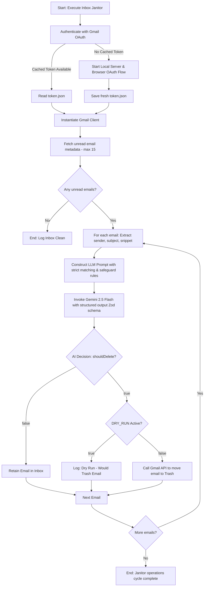

# 🧹 Inbox Janitor Agent

[](https://deepmind.google/technologies/gemini/)
[](https://js.langchain.com/)
[](https://www.typescriptlang.org/)
[](https://opensource.org/licenses/ISC)

An AI-powered, defensive Gmail inbox cleaner that uses **LangChain**, **Gemini 2.5 Flash**, and strict **Zod**-enforced classification schemas to safely identify and purge automated newsletter, promotional, and marketing clutter from your inbox.

---

## 🗺️ Architectural Workflow

The following flowchart illustrates how the Inbox Janitor fetches live messages, routes them through the LLM classification engine, and safely executes purge actions.



---

## ✨ Key Features

- 🛡️ **Defensive Classification:** Uses explicit whitelist and safeguard rules to keep your personal or critical messages untouched. If a domain is not explicitly allowed for trashing, the decision is strictly `false` (KEEP).
- 🧬 **Structured AI Output:** Leverages `@langchain/google-genai` `.withStructuredOutput()` to enforce Zod response formatting, returning a boolean `shouldDelete`, a numerical `confidenceScore`, and a text `reasoning`.
- ⚠️ **Dry-Run Safety Toggle:** Includes a safety lock out-of-the-box (`DRY_RUN = true/false`) to preview what the agent will do before it actually trashes any emails.
- ⚡ **Low-Latency Metadata Fetching:** Configured with Gmail `metadata` format, requesting only `From` and `Subject` headers along with the email `snippet` to minimize network overhead and payload sizes.
- 🔑 **Automated Credential Caching:** Performs a one-time browser OAuth flow to authenticate, caching subsequent tokens in `token.json` for seamless, non-interactive execution thereafter.

---

## 📁 Repository Directory Structure

- **[src/index.ts](file:///E:/Project/inbox-janitor-agent/src/index.ts)**: Core application entry point. Coordinates Gmail API querying, runs the LLM reasoning cycle, and acts on classification decisions.
- **[src/agents.ts](file:///E:/Project/inbox-janitor-agent/src/agents.ts)**: Defines the Zod structured classification schema, TypeScript models, and mock email data.
- **[src/gmailService.ts](file:///E:/Project/inbox-janitor-agent/src/gmailService.ts)**: Handles OAuth2 client creation, credential lookup, token caching, and Gmail API client instantiation.
- **[src/gmailActions.ts](file:///E:/Project/inbox-janitor-agent/src/gmailActions.ts)**: Wrapper functions to list/get email metadata headers and move messages to the trash.
- **[package.json](file:///E:/Project/inbox-janitor-agent/package.json)**: Scripts, metadata, and dependencies (LangChain, Google APIs, tsx, typescript).
- **[tsconfig.json](file:///E:/Project/inbox-janitor-agent/tsconfig.json)**: TypeScript configuration specifying ESM compilation target and module resolution parameters.

---

## 🚀 Getting Started

### 1. Prerequisites

- **Node.js** (v18 or higher recommended)
- **Google Cloud Project** with:
  1. The **Gmail API** enabled.
  2. An **OAuth Consent Screen** configured for External users (add your email as a test user).
  3. Credentials generated for a **Desktop Application** (downloaded as `credentials.json` and saved in the root of this project).
- **Gemini API Key** from [Google AI Studio](https://aistudio.google.com/).

### 2. Project Setup

Clone or place the project files in your workspace, then navigate to the root directory and install dependencies:

```bash
npm install
```

Create a `.env` file in the root directory and add your Gemini API Key:

```env
GEMINI_API_KEY=your_gemini_api_key_here
```

Ensure your Google OAuth secrets are in the root directory under the filename:
`credentials.json`

### 3. Running the Janitor

Run the main file in developmental mode using `tsx`:

```bash
npm run dev
```

> [!IMPORTANT]
> **First Run Experience:**
> On your first run, if `token.json` is missing, the application will print:
> `No valid cached token found. Starting interactive OAuth flow...`
> It will automatically open your default browser. Select your Google account, click through the unverified app warnings (if any), and complete the authorization. The client will then cache the credentials to `token.json` for subsequent silent executions.

### 4. Safety Lock & Custom Classification Rules

Before deploying or running on a large mailbox, review the `DRY_RUN` setting in [src/index.ts](file:///E:/Project/inbox-janitor-agent/src/index.ts#L9-L10):

```typescript
// SAFETY TOGGLE: Set to false only when you are ready to let the AI actually delete emails!
const DRY_RUN = false; 
```

To modify which emails are classified for deletion, update the `systemInstructions` text in `src/index.ts` to add or remove domains.

### 5. Gmail Authentication & Refresh Token Rotation (CI/CD)

To run the Inbox Janitor non-interactively in GitHub Actions:
1. **Initial Authentication & Token Generation**:
   Run the local token generation utility to mint a refresh token:
   ```bash
   npx tsx scripts/generate-refresh-token.ts
   ```
   Follow the link printed to your terminal to authorize the application. Once authorized, the console will print the new `GMAIL_REFRESH_TOKEN` and the raw `TOKEN_JSON` content, and write it to `token.json` locally.

2. **Google Cloud Consent Screen Configuration**:
   To prevent your refresh token from expiring after 7 days, ensure your **OAuth consent screen** publishing status is set to **In production** (or published) in the Google Cloud Console. If it remains in **Testing**, Google will automatically expire the refresh token every 7 days, causing GitHub Actions to fail.

3. **Update GitHub Secrets**:
   If the token expires or is revoked (failing with `invalid_grant`), regenerate it locally using the steps above and update `TOKEN_JSON` (containing the complete credentials structure) under Settings → Secrets and variables → Actions.

---

## 🧪 Labs Experiment Context

This project is formatted to run as a backend script or a cron task. In a labs dashboard, this can be integrated with:
1. **GitHub Actions / Cron Schedules:** Running `npm run dev` periodically (using a pre-authenticated `token.json` stored in encrypted environment variables or volumes).
2. **Dashboard Visualizations:** Creating a simple React interface that reads the dry-run output and lists clean-up candidates for manual approval.
